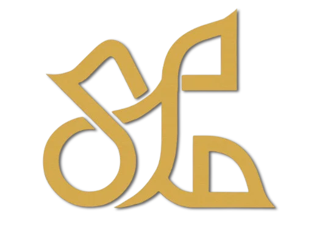

<p align="center">
  
</p>

## 📋 Description

Site web officiel du **Palais El Mokri**, un joyau architectural situé à Fès, Maroc. Cette plateforme moderne permet aux visiteurs de découvrir l'histoire du palais, réserver des visites guidées, explorer les options d'hébergement et plonger dans la richesse culturelle marocaine.

## 🚀 Technologies Utilisées

### **Frontend**
- **Next.js 14** - Framework React avec App Router
- **TypeScript** - Typage statique pour une meilleure robustesse
- **Tailwind CSS** - Framework CSS utilitaire
- **Radix UI** - Composants accessibles et personnalisables

### **UI/UX**
- **Lucide React** - Icônes modernes et cohérentes
- **Embla Carousel** - Carrousels fluides et responsives
- **React Hook Form** - Gestion avancée des formulaires
- **Date-fns** - Manipulation des dates

### **Fonctionnalités Avancées**
- **Supabase** - Base de données et authentification
- **Recharts** - Graphiques et visualisations
- **Next Themes** - Support du mode sombre
- **Vercel Analytics** - Analyse des performances

## 📦 Installation

### Prérequis
- Node.js 18+ 
- npm ou pnpm

### Étapes d'installation

1. **Cloner le repository**
```bash
git clone https://github.com/votre-username/palais-el-mokri.git
cd palais-el-mokri
```

2. **Installer les dépendances**
```bash
npm install
# ou
pnpm install
```

3. **Configuration de l'environnement**
```bash
cp .env.example .env.local
```

Configurez les variables d'environnement :
```env
NEXT_PUBLIC_SUPABASE_URL=votre_url_supabase
NEXT_PUBLIC_SUPABASE_ANON_KEY=votre_clé_supabase
```

4. **Lancer le serveur de développement**
```bash
npm run dev
# ou
pnpm dev
```

Ouvrez [http://localhost:3000](http://localhost:3000) dans votre navigateur.

## 📁 Structure du Projet

```
palais-el-mokri/
├── app/                    # App Router de Next.js
│   ├── globals.css        # Styles globaux
│   ├── layout.tsx         # Layout principal
│   ├── page.tsx          # Page d'accueil
│   └── visite/           # Pages des visites
├── components/            # Composants React réutilisables
│   ├── client/           # Composants côté client
│   ├── layout/           # Composants de mise en page
│   ├── sections/         # Sections de pages
│   └── ui/              # Composants UI de base
├── contexts/             # Contextes React
├── hooks/               # Hooks personnalisés
├── lib/                 # Utilitaires et configurations
├── public/              # Assets statiques
│   └── optimized/       # Images optimisées
└── scripts/             # Scripts utilitaires
```

## 🔧 Configuration

### **Base de données (Supabase)**
1. Créez un projet sur [Supabase](https://supabase.com)
2. Configurez les tables nécessaires
3. Ajoutez les clés dans `.env.local`

## 📱 Responsive Design

Le site est entièrement responsive et optimisé pour :
- 📱 **Mobile** : 320px - 768px
- 📟 **Tablette** : 768px - 1024px  
- 🖥️ **Desktop** : 1024px+

## 📄 Licence

Ce projet est sous licence MIT. Voir le fichier `LICENSE` pour plus de détails.

## 🙏 Remerciements

- Conservateurs du Palais El Mokri
- Communauté open source
- Artisans et guides locaux

---
<P align="center">
  <strong>Développé avec ❤️ pour préserver et partager le patrimoine marocain</strong>
</p>

